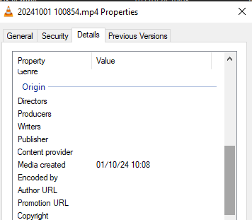

# Intro

Running [handbrake](https://handbrake.fr/) on videos that are then uploaded to google photos, 
loses its place in the timeline. You need to set a custom attribute on the file called 
'Media created' to have it be placed there correctly



This script applies this bulk change based on the file name (format generated by my phone)
or by reading in the modified time of the original file

Tip: Remember to un-sync the original file from your phone, or it will be re-uploaded again

# Running

Must run from windows commandline as administrator when installing pypiwin32

```shell
py -m venv .venv

.venv\Scripts\activate.bat


pip install -r requirements.txt

# If admin mode was missed, enter admin, and run
# Ensure that it is actually installed
python .venv/Scripts/pywin32_postinstall.py -install
(.venv) c:\Sandbox\test>python .venv/Scripts/pywin32_postinstall.py -install
Parsed arguments are: Namespace(install=True, remove=False, wait=None, silent=False, quiet=False, destination='c:\\Sandbox\\test\\.venv\\Lib\\site-packages')
Copied pythoncom312.dll to C:\WINDOWS\system32\pythoncom312.dll
Copied pywintypes312.dll to C:\WINDOWS\system32\pywintypes312.dll
Registered: Python.Interpreter
Registered: Python.Dictionary
Registered: Python
-> Software\Python\PythonCore\3.12\Help[None]=None
-> Software\Python\PythonCore\3.12\Help\Pythonwin Reference[None]='c:\\Sandbox\\test\\.venv\\Lib\\site-packages\\PyWin32.chm'
Registered help file
Pythonwin has been registered in context menu
Shortcut for Pythonwin created
Shortcut to documentation created
The pywin32 extensions were successfully installed.

# To run, put the original files in .\orig and the converted files in .\stuff
py main.py
```


links
- https://stackoverflow.com/questions/31507038/python-how-to-read-windows-media-created-date-not-file-creation-date
- https://stackoverflow.com/questions/61713787/reading-and-writing-windows-tags-with-python-3